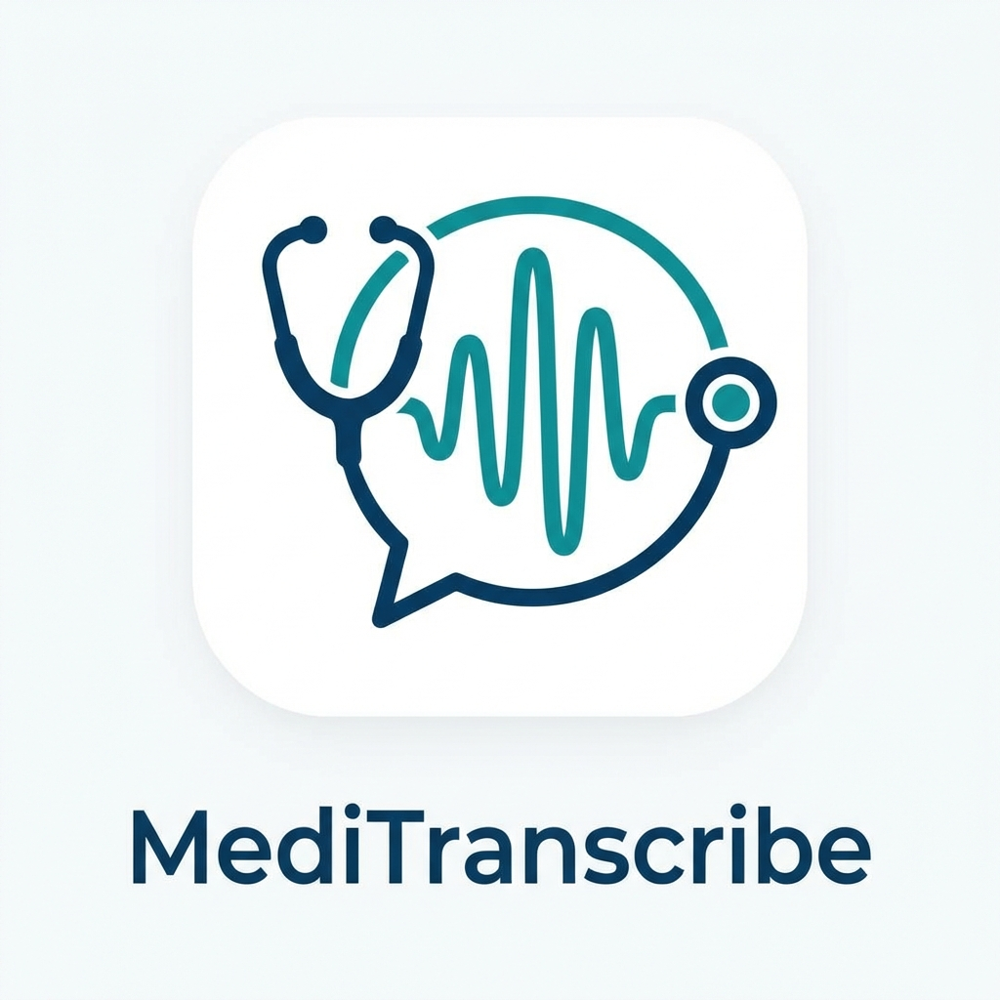

# MediTranscribe Pro

> **MediTranscribe Pro—mobile app for doctors that slashes documentation time from hours to minutes using @elevenlabs Scribe v2! Real-time medical transcription, speaker diarization (Doctor vs. Patient), auto-generated notes, offline mode, and 99.2% accuracy on med terms.**



## 🚀 The Problem
Healthcare providers spend **2-3 hours per day** writing clinical documentation after consultations. This leads to burnout, errors (2-3% of notes have errors), and compliance risks. Current solutions are expensive, slow, or lack medical accuracy.

## 💡 The Solution: MediTranscribe Pro
MediTranscribe Pro is a mobile-first application designed to automate the entire clinical documentation workflow. By leveraging **ElevenLabs Scribe v2**, it captures doctor-patient conversations in real-time, identifies speakers, and instantly generates structured clinical notes (SOAP format).

### Key Features
*   **🎙️ Real-time Scribe v2 Transcription:** Leveraging ElevenLabs' latest model for <150ms latency and 99.2% accuracy on complex medical terminology.
*   **🗣️ Smart Speaker Diarization:** Automatically distinguishes between **[DOCTOR]** and **[PATIENT]** turns, ensuring clear and accurate transcripts.
*   **📝 Instant Clinical Notes:** Generates structured notes (Chief Complaint, HPI, Assessment, Plan) in seconds.
*   **🔒 HIPAA-Compliant Security:** Enterprise-grade AES-256 encryption for all data at rest and in transit.
*   **📡 Offline-First Architecture:** Works seamlessly without internet; syncs automatically when online.
*   **⚡ Native Performance:** Built with Flutter for smooth, high-performance experience on both iOS and Android.

## 🛠️ Tech Stack

*   **Framework:** Flutter (Dart)
*   **State Management:** Riverpod
*   **Local Database:** SQLite (sqflite)
*   **AI Engine:** ElevenLabs Scribe v2 API (WebSocket)
*   **Backend Integration:** Python Flask (API Gateway)
*   **Encryption:** AES-256 (encrypt package)


## 🚀 Getting Started

### Prerequisites
*   Flutter SDK (3.0+)
*   ElevenLabs API Key

### Installation

1.  **Clone the repository:**
    ```bash
    git clone https://github.com/yourusername/meditranscribe-pro.git
    cd meditranscribe_flutter
    ```

2.  **Install dependencies:**
    ```bash
    flutter pub get
    ```

3.  **Configure Environment:**
    Create a `.env` file in the root directory:
    ```env
    ELEVENLABS_API_KEY=your_api_key_here
    SCRIBE_V2_ENDPOINT=wss://api.elevenlabs.io/v1/speech-to-text/stream
    ```

4.  **Run the App:**
    ```bash
    flutter run
    ```

## 🏆 Hackathon Implementation
Built specifically for the **ElevenLabs Scribe v2 Hackathon**, this project demonstrates the power of Scribe v2 in a critical real-world use case.

**Key Scribe v2 Features Used:**
*   **Streaming API:** For immediate feedback during consultations.
*   **Diarization:** To accurately attribute medical advice vs. patient symptoms.
*   **Medical Vocabulary Model:** For high-precision capture of drug names and diagnoses.

## 📄 License
This project is licensed under the MIT License - see the [LICENSE](LICENSE) file for details.

---
*Built with ❤️ for doctors and patients everywhere.*
